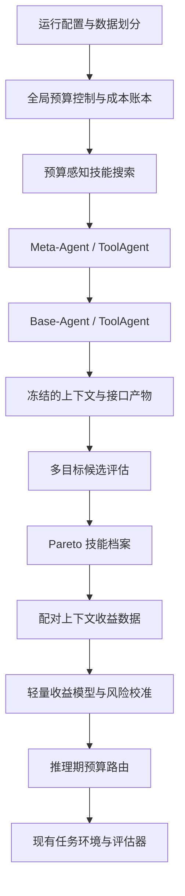

# BR-MCE 分阶段实现计划

## 1. 目标与设计边界

本计划基于当前 `mce_clean_code` 架构和 [《MCE-改进点》](MCE-改进点.md)，将 **BR-MCE：面向有限计算预算与分布偏移的风险感知元上下文工程** 拆分为可独立验收的递进阶段。

当前基线已经由用户在真实双卡 A800 集群验证：原生 OpenAI 兼容 Tool Calling 闭环运行成功，现有 11 项回归测试全部通过。对话与工具服务为 `llama-3.1-8b`，端口 8000；Embedding 服务为 `qwen-embed`，端口 8001。

本计划从论文科研问题与当前稳定实现出发，不依赖历史遗留 Agent 框架。文中新增文件、类名、参数和接口均为拟议设计，尚未实现。本次仅新增计划文档，不修改代码。

建议实施顺序：

**成本审计 → 全局预算执行 → 多目标技能搜索 → 配对收益数据 → 风险感知路由 → 模块归因 → 泛化评测。**

前两阶段建立科研测量基础，第三至第五阶段构成 BR-MCE 核心实现，第六阶段解释机制，第七阶段形成论文证据。

### 1.1 三个需要提前明确的事实

1. 当前仓库注册的是三种**症状诊断流程**，金融、法律、安全和化学环境尚未实现，不能视为已有实验能力。
2. 当前训练批次成绩在 Base-Agent 更新上下文**之前**测得，不能直接作为新候选技能的性能。
3. 现有 rollout 通常只有一种上下文下的结果。收益路由器需要同一样本的配对结果，不能直接从已有记录推导反事实收益。

### 1.2 研究问题与贡献对应

| 科研问题 | 实现贡献 | 主要阶段 |
| --- | --- | --- |
| 严格预算匹配后，技能进化还有多少净增益？ | 端到端成本审计、预算匹配评估 | 一、二、七 |
| 小预算下如何有效生成和选择技能？ | 预算与风险联合优化、多保真筛选、Pareto 档案 | 三 |
| 上下文在哪些样本上有益或有害，如何动态分配？ | 配对收益数据、收益预测与风险路由 | 四、五 |
| 技能编辑的贡献是否可信、是否可迁移？ | 模块差分、局部干预、跨任务迁移 | 六、七 |

模块化差分作为预算感知技能进化的机制设计，不必单独包装成第四项论文贡献。H1～H3 是待检验假设，不是实现完成后必须成立的结论。

## 2. 总体架构与兼容方式

保留当前 `ToolAgent` 作为执行引擎，在外围增加预算、搜索和路由组件。新增轻量路由器运行在 CPU，不训练新的大模型，不增加 Agent 层级。



建议先新增 `mce/br_main.py` 作为研究入口，复用现有执行组件；`mce.main` 与现有集群冒烟脚本继续作为稳定基线。预算与审计接入公共组件时采用可选参数和默认关闭的策略对象。

模型执行仍使用现有 8000/8001 服务。原有函数返回类型、任务接口、单工具调用模式和独立 Embedding 配置继续兼容。

| 阶段 | 核心交付物 | 对应科研问题 | 前置依赖 |
| --- | --- | --- | --- |
| 一 | 可复现实验协议、完整成本账本 | 算法增益与计算量增益如何区分 | 当前基线 |
| 二 | 全局预算执行与可恢复停止 | 如何真正做到预算匹配 | 一 |
| 三 | 多保真搜索、Pareto 技能档案 | 小预算下如何有效进化技能 | 二 |
| 四 | 上下文动作与配对收益数据 | 上下文在哪些样本上有益或有害 | 一、二；复用三的产物 |
| 五 | 收益预测、风险校准、动态路由 | 如何逐样本分配推理预算 | 四 |
| 六 | 模块差分、局部干预、归因报告 | 哪些技能修改产生提升 | 三、四 |
| 七 | 多任务、OOD、迁移与消融实验 | 结论何时成立、能否泛化 | 核心实现完成 |

## 3. 阶段一：可复现实验协议与端到端成本审计

### 3.1 核心目标与创新对应

回答第一个未知问题：现有 MCE 的提升分别消耗了多少 Meta 推理、Base 推理、评估推理和上下文构建成本。

此阶段只观察，不改变搜索策略或模型请求。完整成本审计本身即是可独立交付的科研成果。

### 3.2 架构设计与模块范围

建议新增 `mce/telemetry.py`、`mce/experiment.py`，提供以下组件：

| 组件 | 职责 |
| --- | --- |
| `RunManifest` | 保存代码版本、配置、模型与模板标识、数据划分、随机种子 |
| `CallScope` | 标记调用所属的运行、候选、样本、阶段与动作 |
| `UsageLedger` | 持久化模型调用、工具调用、失败和重试事件 |
| `EvaluationRecord` | 保存完整预测、任务损失、调用成本与执行状态 |

接入位置：

- `mce/agent.py::_complete`：记录每次真实请求的输入/输出 token、耗时、重试和停止原因。
- `mce/llm_client.py::ainvoke`：记录诊断推理成本。
- `mce/workspace_utils/llm.py`、`embedding.py`：记录辅助模型和向量调用。
- `mce/validation.py`：记录运行冒烟校验可能触发的模型调用。
- `mce/eval.py`：将调用事件与样本结果关联。
- `mce/main.py`：保存各阶段成本汇总，不再仅依赖 rollout 数量。

每条模型调用记录至少包含：

```text
run_id / candidate_id / sample_id / phase / action_id
model / request_id / attempt
prompt_tokens / completion_tokens / latency
status / usage_source / cache_hit
```

成本采用多维记录：生成模型输入/输出 token、Embedding token、模型请求数、工具次数和时间。**不将不同模型的 token 简单相加后称为 GPU 算力。** 工具输出被后续模型读取时，已包含在后续输入 token 中，避免重复计费。

完整记录不应依赖当前用于提示词反馈的截断轨迹；可保留紧凑训练反馈，并通过 ID 关联独立审计数据。

### 3.3 数据与复现协议

- 区分技能训练、搜索开发、路由训练、风险校准和最终测试的用途。
- 测试数据放在 Agent 工作区之外，不能由 Meta-Agent 读取。
- 保存固定样本 ID、原始数据指纹和采样顺序，使用局部随机数生成器。
- 当前数据量较小，优先采用训练集内的保留折或交叉拟合，避免机械切成多个过小集合。
- 交叉拟合时，样本所属保留折不得参与对应技能的学习；由此产生的额外构建成本需记账。
- 区分预测错误、执行失败和预算未执行，不混成同一种结果。
- 搜索开发集可提供预先约定的反馈；校准集与最终测试集不能用于反复演进技能。

### 3.4 验证与评测指标

- 模拟响应的 token 汇总必须与账本一致。
- 重试、校验、工具内调用均能关联到正确阶段。
- 缺少 `usage` 时标记为估算或未知，不默认记为零。
- 并发样本之间不能串账。
- 审计开关关闭时，请求 payload 和原有返回类型不变。
- 在集群运行相同小样本实验，统计审计开销、真实成本构成、上下文长度分布和失败率。

### 3.5 风险规避与验收底线

保留 11 项测试全部通过；成本账本可重建一次运行的支出。阶段结束交付首份 MCE 成本审计报告，无需等待路由器完成。

## 4. 阶段二：全局预算执行与可恢复停止

### 4.1 核心目标与创新对应

把预算匹配变成可执行约束。现有 `max_turns`、`max_tokens` 和并发上限均是局部限制，无法控制多轮、多候选和辅助调用的累计成本。

### 4.2 架构设计与模块范围

建议新增 `mce/budget.py`，提供 `BudgetSpec`、`BudgetController`、`BudgetReservation` 和专用异常 `BudgetExhausted`。

预算采用层级结构：

```text
运行总预算
  ├─ 技能搜索与候选构建
  ├─ 搜索评估
  ├─ 路由训练与校准
  └─ 推理评估预算

候选预算 → 样本预算 → 单次请求预算
```

父子预算是同一笔支出的不同视图，不重复扣减。最终论文测试成本单独报告，同时纳入整个研究项目的总成本。

执行流程：

1. 请求发送前原子预留输入与最大输出预算。
2. 返回后按实际 `usage` 结算。
3. 每次重试重新接受预算检查。
4. 预算不足时停止新增请求，保存最后一个已校验产物。
5. 超时且无法确认服务端是否继续生成时，保留保守预留，记录未知成本。

严格模式必须覆盖两个容易遗漏的入口：

- **SDK/LangChain 自动重试**：统一重试责任，或在传输层逐次登记，避免一次逻辑调用实际发送多次请求。
- **Bash 子进程**：当前 Bash 只指定工作目录，子进程可能自行创建客户端，进程内计数器无法覆盖它。

建议先支持受控客户端的预算执行，再增加 CPU 上的本地请求代理，统一执行预留和记账。模型服务仍在 8000/8001，代理仅作为 BR-MCE 模式下的入口。跨线程传递 `CallScope`，跨进程携带运行与候选标识。

**仅使用代理配置不能阻止生成代码直接访问原服务。** 若论文声称所有生成代码调用均受硬预算约束，严格模式还需限制其直连服务；否则将预算保证明确限定在受控调用路径。该限制仅用于研究模式，不改变稳定基线。

token 预估使用集群本地模型 tokenizer 和对应聊天模板，覆盖工具 schema、历史消息与生成提示；不将字符数估计视为严格上限。

预算耗尽必须在 `eval.py` 和任务环境中单独处理，避免被现有宽泛异常捕获转成普通诊断错误。预算恢复以持久化账本为准，不能重启后将支出清零。

### 4.3 验证与评测指标

- 并发请求同时竞争最后一笔预算时，仅满足预留条件的请求获准。
- 测试重试、取消、超时、恢复运行、Bash 辅助调用和校验调用。
- 测试预算停止后不再发送新的模型请求。
- 测试返回最后一个已通过校验的产物，而不是半成品。
- 测试 Agent 最后补充回答也受预算约束。
- 报告预算超支、未结算预留、完成率和有效请求数。

### 4.4 风险规避与验收底线

受控请求的累计已用加预留不突破约定上限。时间预算先定义为停止派发的截止时间；不能声称客户端取消即可立刻停止服务端 GPU 工作。

阶段结束后，可正式运行当前 MCE 与 MCE-Budget-Matched 的对照。

## 5. 阶段三：预算感知多保真搜索与 Pareto 技能档案

### 5.1 核心目标与创新对应

实现文档创新点一：将单技能逐轮自由演进扩展为少量候选、分层验证以及成本和风险联合选择。

### 5.2 架构设计与模块范围

建议新增 `mce/search.py`、`mce/pareto.py` 和研究入口 `mce/br_main.py`：

| 组件 | 职责 |
| --- | --- |
| `SkillCandidate` | 保存技能、父候选、产物指纹、构建成本与状态 |
| `SearchScheduler` | 控制候选生成、构建、筛选与晋级 |
| `FidelitySchedule` | 定义分层评估样本规模 |
| `ParetoArchive` | 维护性能、推理成本与风险之间的非支配候选 |

扩展 `meta_agent.py` 与提示词，让 Meta-Agent 看到剩余预算、已用成本、候选成绩和失败历史。**预算提示帮助提出策略，执行约束仍由控制器负责。**

每个候选拥有独立目录和训练状态：

```text
提出技能 → Base-Agent 构建 → 接口校验 → 冻结产物
        → 小样本评估 → 晋级评估 → 档案更新
```

首版建议每轮最多 2～4 个候选。评估采用嵌套、按标签和预先定义切片分层的样本集，例如 `10 → 30 → 完整开发集`；具体规模依据试验数据调整。10 个样本不能代表当前全部 22 类疾病。

关键设计：

- 晋级评估复用已获得的样本结果，避免重复推理。
- 扩大评估样本量时冻结上下文产物；若重新学习，建立新候选版本。
- 所有候选使用共同评估样本，支持配对比较。
- 不确定性过大时追加预定样本，不把微小差异当作可靠淘汰依据。
- 保留低成本或高鲁棒性候选，避免单纯按准确率淘汰。
- 最终档案候选接受统一确认评估，防止不同保真度分数直接比较。
- 记录整个搜索的累计成本，包括被淘汰候选；候选推理成本与构建成本分别保存。

逐步增加资源和提前停止的设计可借鉴 Successive Halving/Hyperband，其在本项目中的效果仍需实验验证：[Hyperband 原始论文](https://www.jmlr.org/papers/v18/16-558.html)。

初版采用预定评估节点和多重比较控制。若后续增加逐样本自适应淘汰，再考虑时间一致的置信序列，避免反复查看普通置信区间产生错误解释：[置信序列研究](https://arxiv.org/abs/1810.08240)。

### 5.3 验证与评测指标

- 用人工构造候选检查晋级、淘汰、Pareto 支配与恢复逻辑。
- 检查候选目录、缓存和模型导入状态隔离；动态导入可能保留跨候选模块缓存，不能仅依赖不同目录。
- 固定训练预算比较：当前 MCE、预算匹配 MCE、BR-MCE 搜索。
- 报告性能—累计训练成本曲线、达到目标性能的成本、候选失败率和错误淘汰率。
- 消融：取消多保真筛选、取消成本目标、取消风险目标。

风险首版采用已有标签或输入切片的最差性能与失败率。跨种子方差作为最终评测指标，避免每个候选都运行三个种子而耗尽搜索预算。

### 5.4 风险规避与验收底线

预算到期能返回有效档案；无法确认候选优越性时保留原有效产物。工程验收要求搜索流程可靠，科研验收要求预算匹配前沿有所改善，两者分别记录。

## 6. 阶段四：上下文动作与配对收益数据

### 6.1 核心目标与创新对应

回答上下文是否对所有样本都有帮助，为动态路由建立可靠监督信号，对应文档 H2。

### 6.2 架构设计与模块范围

建议新增 `mce/context_policy.py`、`mce/paired_eval.py`，提供 `ContextAction`、`ContextPolicy`、`PairedEvaluator` 和 `GainDataset`。

首版在单步诊断环境中实现四种动作：

| 动作 | 内容 | 主要成本 |
| --- | --- | --- |
| `a0` | 不添加学习上下文 | 基础诊断请求 |
| `a1` | 预先构建的短上下文 | 较短模型输入 |
| `a2` | 少量相关知识模块检索 | Embedding、检索与诊断 |
| `a3` | 完整学习上下文或动态函数 | 上下文构建与完整推理 |

短上下文在离线构建阶段生成并记账，避免每个样本临时调用模型压缩。

通过 `ContextPolicy` 包装现有 `get_context(symptoms)`，不改变已验证接口签名。后续两步环境按两个阶段分别分配上下文；Agent 环境控制可读知识视图、工具结果长度与累计输入预算，不能只限制文件大小。

对固定技能快照，在相同样本上记录：

$$
\Delta_i(a)=L(y_i,\hat y_i^{0})-L(y_i,\hat y_i^{a})
$$

分类零一损失下收益为 `-1、0、1`。同时记录动作完整成本，包括检索与动态函数内部调用。

预算节省方式：

- 仅补齐缺失配对结果，复用可验证的已有预测。
- 首版选择少量动作和分层样本，不对全部历史候选穷举。
- 缓存键包含样本、技能与上下文版本、模型、模板及解码配置。
- 跨实验共享预计算结果时，同时报告实际执行成本与统一协议下的逻辑成本，不能让某个方法获得未计费预计算优势。

### 6.3 验证与评测指标

- 检查收益正负号、配对样本 ID、缓存失效与动作成本。
- 统计正收益率、负收益率、无变化率及各切片收益分布。
- 报告全量上下文相对无上下文的平均收益。
- 报告成本约束下 Oracle 动作上界，判断值得投入的路由空间。

### 6.4 风险规避与验收底线

路由特征与执行输入不包含标签；标签仅用于离线评分。Oracle 仅作为分析上界，不进入部署决策。

配对数据必须绑定冻结的技能快照。此阶段可独立交付上下文收益审计报告，即使路由训练暂未开始，也能提供科研证据。

## 7. 阶段五：收益预测、风险校准与推理期动态路由

### 7.1 核心目标与创新对应

实现创新点二：预测哪个上下文动作值得使用，控制负上下文收益风险，并逐样本分配推理预算。

### 7.2 架构设计与模块范围

建议新增 `mce/routing.py`、`mce/calibration.py`，提供：

- `FeatureExtractor`
- `GainPredictor`
- `RiskCalibrator`
- `BudgetRouter`
- `RoutingDecision`

首版使用 CPU 上的正则化线性模型；风险可采用独立分类头。避免一开始引入大型 MLP 或复杂强化学习。

特征按成本递进：

| 层级 | 特征 | 使用方式 |
| --- | --- | --- |
| 零额外模型调用 | 输入长度、结构、可用知识模块信息 | 默认启用 |
| 一次 Embedding | 最近邻距离、相似度、检索间隔 | 计入路由成本 |
| 额外诊断调用 | 基础预测与短上下文预测分歧 | 单独作为级联方案 |

不能假设当前服务已提供可校准的标签概率。生成 token 的 log probability 不等同于完整疾病分布的 entropy；概率特征须先验证接口与计算方式。

选择规则可实现为：

$$
a^*=\arg\max_{a\in\mathcal A_B}
\left[\widehat\Delta(x,a)-\lambda\widehat C(x,a)-\gamma\widehat U(x,a)\right]
$$

其中可行动作集合 `𝒜_B` 同时满足剩余样本与运行预算、动作风险阈值和服务上下文上限。

预测成本用于动作排序，真实执行仍受阶段二约束。路由失败或动作不可用时回退 `a0`；**回退请求也需要预算**，派发高成本动作前应预留回退额度。

当前硬件仅有一个对话模型，所以文档中的更强模型回退暂不实施。

校准集独立于搜索与收益模型拟合。每次更换技能快照、动作实现或模型后，重新检查校准适用性。首版实现经验风险校准，保形方法作为后续增强；不能直接宣称任意路由器在 OOD 下均有保证。

保形风险控制有具体损失与分布条件，参考：[Conformal Risk Control](https://arxiv.org/abs/2208.02814)。

### 7.3 验证与评测指标

比较以下路由策略：固定完整上下文、固定短上下文、随机路由、输入长度路由、检索相似度路由、收益预测路由和成本约束 Oracle。

重点报告：

- 同平均推理成本下的性能。
- 同性能下的推理 token、请求数和延迟。
- 负上下文收益率。
- 使用学习上下文的覆盖率与风险曲线。
- 动作分配比例、预算违规率与回退率。

必须包含路由特征获取成本。若先执行两个动作才能选择第三个动作，前三次请求均需记账。

### 7.4 风险规避与验收底线

预算紧张、特征缺失或校准失效时有可执行回退路径。校准样本不足时报告不确定性，不宣称低风险已得到保证。

科研目标是接近完整上下文性能时降低成本，或在相同成本下改善性能与风险；不提前规定必须取得多少百分点提升。

**阶段一至五完成后形成 BR-MCE 工程 MVP。**

## 8. 阶段六：模块化技能差分与可归因进化

### 8.1 核心目标与创新对应

实现文档第三项机制设计，检验 H3：小预算下局部编辑是否比整体重写更稳定。

### 8.2 架构设计与模块范围

建议新增 `mce/skill_spec.py`、`mce/attribution.py`，提供 `SkillSpec`、`SkillEdit`、`EditValidator` 和 `AttributionEvaluator`。

技能划分为数据诊断、知识构建、检索、组合、验证与路由六个模块。保存结构化清单及版本指纹，仍渲染为 `SKILL.md` 供当前 Base-Agent 使用。

每次 Meta-Agent 提交：

```text
parent_skill / target_module / operation
hypothesis / expected_benefit / expected_cost
rollback_condition
```

实施规则：

- 首版每个候选只允许一个目标模块编辑。
- 验证模块依赖与产物变更范围。
- 使用配对样本比较父技能和编辑技能。
- 涉及生成代码的修改沿用现有接口校验。
- 非目标模块发生明显变化时，标记为复合修改，不视为单模块归因证据。

需要区分两类实验：

1. **产物级干预**：固定其他代码与知识，仅替换一个模块，研究局部贡献。
2. **技能级干预**：父技能和新技能从共同起点、相同训练数据与预算重新生成产物，研究方法变化。

仅修改 `SKILL.md` 一段文字不能保证 Base-Agent 只修改对应产物，两类实验不能混为一谈。

### 8.3 验证与评测指标

- 检查父版本匹配、依赖合法性、单模块变更与回滚。
- 报告配对性能差及区间、成本增量、两种以上预定义切片上的效果。
- 比较整体重写与模块编辑的有效候选比例、构建失败率、回滚率和跨种子方差。
- 将被拒绝编辑的计算成本纳入搜索总成本。
- 迁移时优先复用检索和组合方法，区分其与疾病知识的迁移。

### 8.4 风险规避与验收底线

归因报告明确干预对象和控制条件。配对比较支持局部效果估计，不自动等同于一般化因果结论。小样本证据不足时标记不确定，避免强行接受编辑。

## 9. 阶段七：多任务、分布偏移与迁移的论文级评测

### 9.1 核心目标与创新对应

检验三个未知问题及 H1～H3，形成性能—成本—风险的完整证据，并说明结论成立与失败的条件。

### 9.2 架构设计与模块范围

建议新增统一实验配置、基线适配器、OOD 数据清单和报告工具：

- `experiments/configs/`
- `experiments/run_matrix.py`
- `mce/analysis/`
- 新任务的 `TaskEnvironment` 实现

扩展顺序：

1. 症状诊断完成三档预算、三个种子及主要消融。
2. 新增金融实体识别与安全分类两个环境。
3. 开展跨任务技能迁移与第二基础模型验证。
4. 法律与化学作为资源允许时的补充实验。

当前三种诊断流程可用于架构验证，但不能充当三个独立领域任务。金融序列标注采用实体级 F1，安全分类定义相应召回指标，不能套用诊断准确率。

### 9.3 对照与消融

基线从当前稳定实现出发：

| 方法 | 定义 |
| --- | --- |
| Base | 无学习上下文 |
| Fixed Context | 冻结的人工上下文 |
| MCE-Full | 当前 MCE 的固定参考配置 |
| MCE-Budget-Matched | 当前 MCE 加同一预算控制器 |
| BR-MCE | 多目标搜索与风险路由 |
| 关键消融 | 去路由、去风险、去多保真、整体重写 |

GEPA 与 ACE 后续通过独立适配器接入，同样纳入成本账本。没有复现论文原始配置时，明确称为当前实现的 MCE 基线，不宣称完整论文复现。

主要消融还应包括：

- 在相同硬预算下，移除预算感知选择目标，仅优化性能。
- 将收益预测替换为普通置信度或检索相似度。
- 比较整体重写与模块化编辑。
- 取消早停与多保真评估。
- 比较技能跨模型与跨任务迁移。

### 9.4 预算、数据与服务协议

- 用阶段一审计获得的参考成本定义 Low、Medium、High，比例参考文档的约 10%、25%～40%、100%。
- 各方法共享基础模型、数据、种子、调用上限、解码设置与服务条件。
- 搜索与选择在开发数据上完成，最终 ID/OOD 测试保持封存。
- 类别先验偏移通过重加权或采样实现；输入形式偏移采用顺序变化、结构变化和干扰内容，并检查标签语义是否保持。
- 重复采样不增加独立样本数，统计区间按原始样本组织。
- 先用固定种子验证工程流程，再运行三个科研种子。
- 第二对话模型采用独立实验时段替换服务，保留 Qwen 服务，避免额外模型同时占用现有显存。
- 吞吐与延迟实验区分冷启动和热缓存，固定服务并发与后台负载；多个研究运行不要同时共享服务测延迟。

### 9.5 验证与评测指标

论文主结果至少包含：

- 测试性能—累计训练成本曲线。
- 测试性能—平均推理成本曲线。
- 成本—性能—风险 Pareto 前沿。
- ID/OOD 与最差切片性能。
- 负上下文收益率、覆盖率与路由遗憾。
- 三个种子的均值、标准差及配对区间。
- 达到目标性能的成本与失败候选成本。
- 若报告预算曲线面积，明确预算范围与归一化方式。

### 9.6 风险规避与验收底线

工程完成不以假设一定成立为条件。若路由在收益同质任务中无优势，或局部编辑在高预算下不如整体重写，应作为研究结果报告。

极端 OOD 下的校准失效、弱模型执行复杂技能失败、候选小样本排名不稳定，均属于应分析的失败条件。

## 10. 贯穿各阶段的可用性底线

1. **保留稳定运行路径。** 新功能默认关闭，原有模型名称、端口、原始文本 Embedding 协议与配置优先级保持兼容。
2. **原有 11 项测试作为不可放宽的门槛。** 在其基础上增加预算、账本、候选隔离与路由测试，不能修改旧断言来迁就新行为。
3. **分层验收。** 每阶段依次通过语法与单测、模拟 HTTP 集成、原集群冒烟、该阶段的小规模真实实验。
4. **产物版本化。** 保留最后一个有效技能；新候选失败、预算耗尽或风险校验不通过时可恢复。
5. **区分工程验收与科研结论。** 流程完整、预算可控、数据无泄漏是硬门槛；方法是否优于基线由预算匹配实验判断。
6. **控制首轮投入。** 先用单步症状诊断、一种对话模型和少量候选完成阶段一至五；扩展任务、模型与模块归因时沿用已有账本和评测协议。

## 11. 讨论与决策节点

每个节点应基于前一阶段产物做具体决策，而不是一次性确定所有参数：

| 决策节点 | 需要确认的内容 | 决策依据 |
| --- | --- | --- |
| 阶段一结束 | 主成本维度、参考预算、数据划分方式 | 实际成本审计与数据规模 |
| 阶段二结束 | 严格预算覆盖范围、是否启用请求代理与直连限制 | 子进程调用覆盖率、预算执行测试 |
| 阶段三结束 | 候选数量、保真度阶梯、风险目标 | 淘汰稳定性、搜索支出与 Pareto 前沿 |
| 阶段四结束 | 路由动作集合与训练规模 | 配对收益异质性、Oracle 上界 |
| 阶段五结束 | 是否增加昂贵概率特征或保形校准 | 路由净收益、校准风险与额外成本 |
| MVP 完成后 | 模块归因优先级、跨任务扩展顺序 | 剩余预算、主结果稳定性与论文证据缺口 |

## 12. 参考资料

- [仓库设计文档：《MCE-改进点》](MCE-改进点.md)
- [当前集群部署记录](llm_deployment_summary.md)
- [现有集群运行说明](CLUSTER_RUN.md)
- [现有 11 项回归测试](tests/test_cluster_runtime.py)
- [Hyperband: A Novel Bandit-Based Approach to Hyperparameter Optimization](https://www.jmlr.org/papers/v18/16-558.html)
- [Time-uniform, nonparametric, nonasymptotic confidence sequences](https://arxiv.org/abs/1810.08240)
- [Conformal Risk Control](https://arxiv.org/abs/2208.02814)
